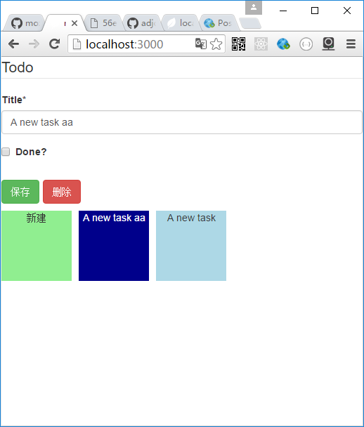

# rest-form-editor

RestFormEditor是对react-jsonschema-form的封装，用于给Restful服务提供CRUD的表单和浏览

Server:


假如服务器端在/api/post提供了一套标准的CRUD服务:  

    GET     /       ->  list all
    GET     /:id    ->  read one
    POST    /       ->  insert
    PUT     /:id    ->  update
    DELETE  /:id    ->  remove

Client:

RestFormEditor用于给Restful服务提供CRUD的表单和浏览


属性：

url:服务地址，如/api/post  
keyField: id字段的字段名  
thumbView: 浏览时显示每个数据项的view
其他属性透明传递到内层的react-jsonschema-form中。详见 [react-jsonschema-form](https://github.com/mozilla-services/react-jsonschema-form) 

浏览组件的样式可参照browser.less


样例：

```js
require('./browser.less');
var RestFormEditor=require('react-restui/lib/client/rest_form_editor');
const ThumbView=(props)=><div>{props.data?props.data.title:"新建"}</div>

var RestWriter=require('react-restui/lib/client/rest_writer');

const schema = {
  title: "Todo",
  type: "object",
  required: ["title"],
  properties: {
    title: {type: "string", title: "Title", default: "A new task"},
    done: {type: "boolean", title: "Done?", default: false}
  }
};


ReactDOM.render(
    <RestFormEditor schema={schema}
                    url="/api/post"
                    keyField="_id"
                    thumbView={ThumbView}/>
,
  document.getElementById('root')
);

```

## Examples

node app.js  
open http://localhost:3000

