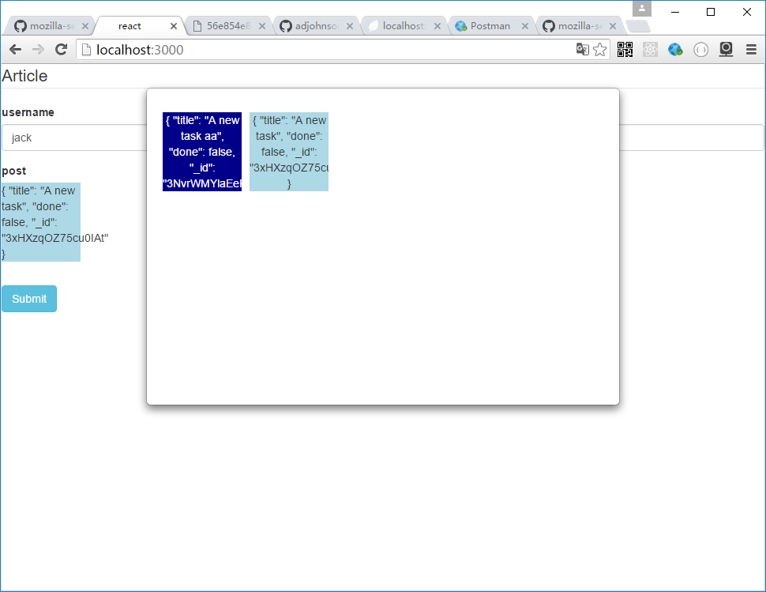

# rest-field

restField生成用于react-jsonschema-form的自定义域

Server:


假如服务器端提供对url的GET方法

Client:

const PostField=restField({url:'/api/post',keyField:'_id',thumbView:ThumbView});


属性：

url:服务地址，如/api/post  
keyField: id字段的字段名  
thumbView: 浏览时显示每个数据项的view


浏览组件的样式可参照style.less


样例：

```js
import Form from "react-jsonschema-form";
var restField=require('react-restui/lib/client/rest_field');
require('./style.less');


const schema = {
  title: "Article",
  type: "object",
  required: ["title"],
  properties: {
    username: {type: "string", title: "username", default: "jack"},
    post: {title:'post', type: "string"}
  }
};

const PostField=restField({url:'/api/post',keyField:'_id',thumbView:ThumbView});
const fields = {post: PostField};
const uiSchema = {
  post:{"ui:field": "post"}
}

const ThumbView=(props)=><div>{props.data?props.data.title:""}</div>

ReactDOM.render(
    <Form schema={schema}
     uiSchema={uiSchema}
     fields={fields}/>
,
  document.getElementById('root')
);

```

## Examples

node app.js  
open http://localhost:3000

