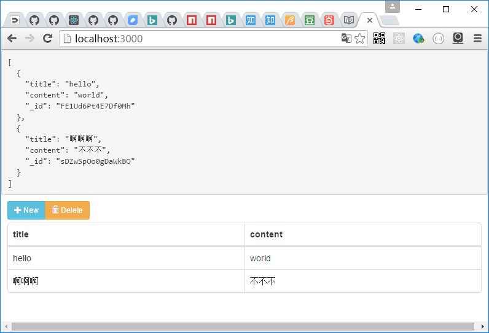

# rest-reader

Server:

假如服务器端提供了一个可以GET的url

Client:

RestReader将GET url,将返回的数据作为data属性传递给view


属性：

url:服务地址，如/api/post  
view: 一个react组件，拥有data属性 
subscribe:一个字符串消息数组。当用PubSub发布数组内的消息时，RestReader将自动刷新数据  
其他属性透明传递到view 

样例：

```js
var RestReader=require('react-restui/lib/client/rest_reader');

const Viewer=props=><pre>{JSON.stringify(props.data,null,2)}</pre>
        
ReactDOM.render(
   <RestReader url='/api/post' view={Viewer}/> 
```

## Examples

node app.js  
open http://localhost:3000

