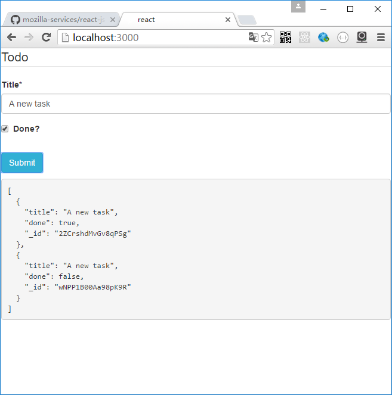

# rest-writer

RestWriter用于给一个react 组件注入save和update,remove方法

Server:

服务器端提供了一个可以POST或PUT的url

Client:

RestWriter包装的view组件调用props.save(data)时，post数据到url。调用props.update(data)时，put数据到url。调用props.remove()时，delete url/id的数据


属性：

url:服务地址，如/api/post  
view: <YourView save={data=>{...return promise}} update={data=>{...return promise}} remove={()=>{...return promise}} {...otherProp}/>
id:（可选）数据的id字段名（若要使用update方法，该属性必须传入)
publish:（可选）一个字符串或者对象。表明当save或update动作更新时发出的消息 

样例：

```js
import Form from "react-jsonschema-form";
var RestReader=require('react-restui/lib/client/rest_reader');

const Viewer=props=><pre>{JSON.stringify(props.data,null,2)}</pre>

var RestWriter=require('react-restui/lib/client/rest_writer');

const schema = {
  title: "Todo",
  type: "object",
  required: ["title"],
  properties: {
    title: {type: "string", title: "Title", default: "A new task"},
    done: {type: "boolean", title: "Done?", default: false}
  }
};

const todoForm=(props)=><Form schema={schema} onSubmit={(obj)=>props.save(obj.formData)}/>

ReactDOM.render(
  <div>
    <RestWriter url="/api/post" view={todoForm}  publish="changed"/>
    <RestReader url='/api/post' view={Viewer} subscribe={["changed"]}/> 
  </div> ,
  document.getElementById('root')
);
```

## Examples

node app.js  
open http://localhost:3000

