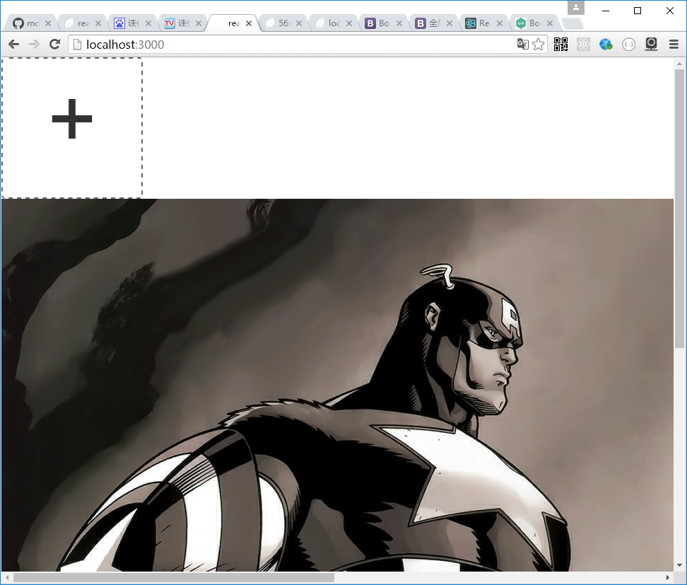

# UploadZone

UploadZone用于上传文件到服务器

Server:

引用中间件，参数为express app和上传路径
require('react-restui/lib/server/uploadify')(app,'uploads'); //for upload_zone


Client:

<UploadZone url="/upload" onUploaded={(files)=>{}} accept="image/*"/>


属性：

url:服务地址，中间件提供的服务为"/upload" 
view: 在UploadZone中显示的view
onUploaded:上传完成的回调
其他:参考react-dropzone组件。

样例：

```js
var UploadZone=require('react-restui/lib/client/upload_zone');

class ImageUploader extends React.Component {
    constructor(props) {
        super(props);
        this.state = {
        };
    }

    render() {
        let me = this;
        const {url}=this.state;
        return (
            <div className="image_uploader">
                 <UploadZone url="/upload" onUploaded={this.onUploaded.bind(this)} accept="image/*">
                 {!url?null:}
                 </UploadZone>
            </div>
        );
    }

    onUploaded(files){
        console.log(files[0])
        this.setState({url:files[0].url});
    }
}

ReactDOM.render(
  <ImageUploader/>,
  document.getElementById('root')
);


```

## Examples

node app.js  
open http://localhost:3000

