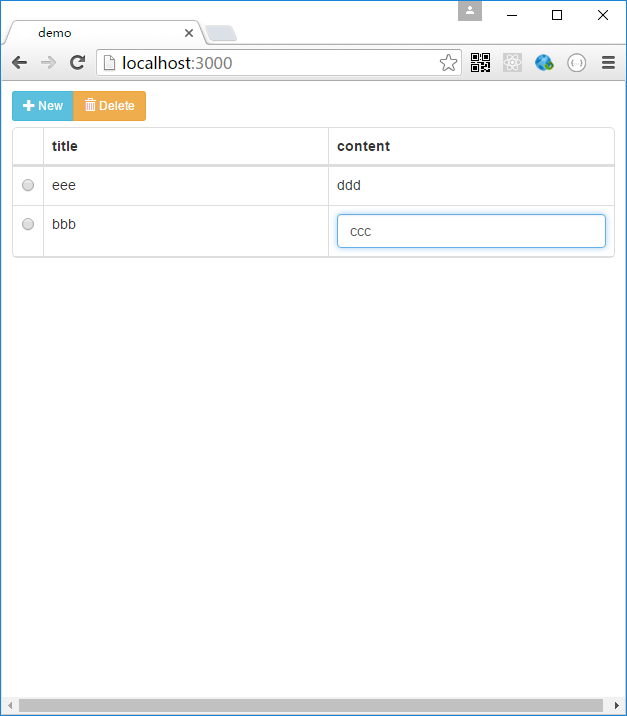

# react-rest-table

If you have standard RESTful routes:

    GET     /       ->  list all
    GET     /:id    ->  read one
    POST    /       ->  insert
    PUT     /:id    ->  update
    DELETE  /:id    ->  remove

set the url and keyField , then you have a CRUD table.
It just binds restful service to react-bootstrap-table. More options please ref to [react-bootstrap-table](https://github.com/AllenFang/react-bootstrap-table)

```js
<RestfulTable url='/api/post' keyField="_id" >                
    <TableHeaderColumn dataField="..." >...</TableHeaderColumn>
    <TableHeaderColumn dataField="..." >...</TableHeaderColumn>
</RestfulTable>
```

## Examples

